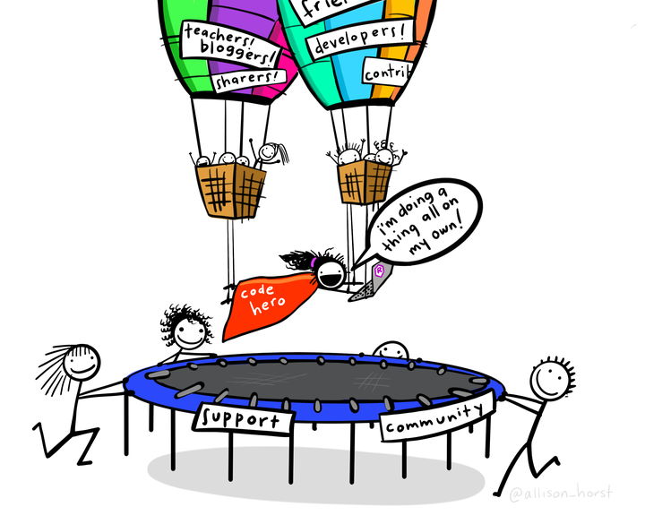

Linguagem R
================

Linguagem R

**RStudio**:

Disciplina de Análise de Dados com R para alunos de pós-graduação. O
conteúdo é todo baseado no universo do
[`{tidyverse}`](https://www.tidyverse.org).

Será coberto conteúdos sobre leitura, manipulação e exportação de dados
com R. Recomendo o livro **R para Data Science** (Figura
@ref(fig:data-science-book)) que pode ser encontrado gratuitamente
[aqui](https://r4ds.had.co.nz) e possui uma [versão impressa em
português](https://www.amazon.com.br/Para-Data-Science-Hadley-Wickham/dp/8550803243).

R for Data Science

## Professor

Prof. Dr. José Eduardo Storopoli - [Currículo
*Lattes*](http://lattes.cnpq.br/2281909649311607) -
[ORCID](https://orcid.org/0000-0002-0559-5176) - <https://storopoli.io>

<josees@uni9.pro.br>

## Como usar esse conteúdo?

Este conteúdo possui *licença livre para uso* (CC BY-SA). Caso queira
utilizar o conteúdo para um curso ou estudos, por favor colabore nesse
repositório quaisquer aprimorações que foram realizadas.

Para configurar um ambiente local:

1.  Clone o repositório do GitHub:
    `git clone https://github.com/storopoli/Linguagem-R.git`
2.  Acesse o diretório: `cd Linguagem-R`
3.  Instale os pacotes necessários: `Rscript .binder/install.R`

## Aulas

-   [**Aula 1 - O que é
    R?**](https://storopoli.io/Linguagem-R/1-O_que_e_R.html): Tipos de
    Varíaveis, Estrutura de Dados, RStudio e Rmarkdown.
-   [**Aulas 2 e 3 — Manipulação de
    Dados**](https://storopoli.io/Linguagem-R/2-Manipulacao_Dados.html):
    `dplyr`, `readr`, `tidyr` e `stringr`.
-   [**Aulas 4 e 5 — Visualização de
    Dados**](https://storopoli.io/Linguagem-R/3-Visualizacao_Dados.html):
    `ggplot2`, `scales`, `patchwork`, e mais.
-   [**Aulas 6 — Programação
    Funcional**](https://storopoli.io/Linguagem-R/4-Programacao_Funcional.html):
    `purrr` e `furrr`.
-   [**Aula 7 — Regressão Linear e Regressão
    Logística**](https://storopoli.io/Linguagem-R/5-Regressao.html):
    `lm` e `glm`.

## Como citar esse conteúdo

Para citar o conteúdo use:

    Storopoli (2021). Linguagem R. Disponível em: https://storopoli.io/Linguagem-R.

Ou em formato BibTeX para LaTeX:

    @misc{storopoli2021linguagemR,
      author = {Storopoli, Jose},
      title = {Linguagem R},
      url = {https://storopoli.io/Linguagem-R},
      year = {2021}
    }

## Licença

Este obra está licenciado com uma Licença [Creative Commons
Atribuição-CompartilhaIgual 4.0
Internacional](http://creativecommons.org/licenses/by-sa/4.0/).

